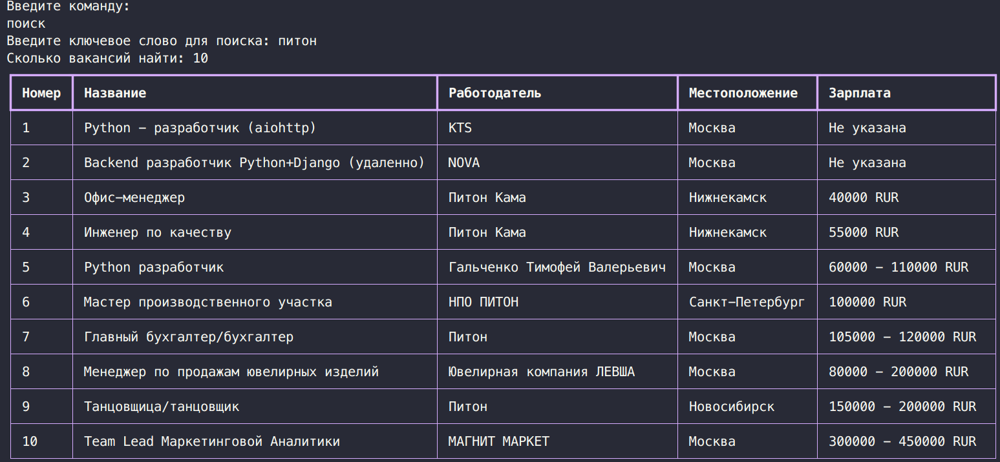

# Работа с вакансиями с hh.ru

1. Базово, вся программа состоит из двух классов:
    * Screen
    ```python
    class Screen(ABC):
    '''
    Абстрактный класс экрана, от которого должны наследоваться все экраны.
    Вся программа состоит из набора экранов, 
    которые соединены между собой через различные команды.
    Экраны содержат в себе набор команд, доступных на исполнение по вводу пользователя,
    для исполнения команды у экрана используется метод __call__, 
    который вызывает метод execute у определенной команды.
    Все объекты команд должны находиться в property "commands": List[Command].
    '''

    def __init__(self, context=None):
        self.context = context or {}

    def __contains__(self, user_input: str) -> bool:
        for command in self.commands:
            if user_input == command:
                return True
        return False

    def __getitem__(self, user_input: str) -> Command:
        if user_input in self:
            for command in self.commands:
                if user_input == command:
                    return command

    async def __call__(self, user_input: str) -> 'Screen':

        if user_input in self:
            return await self[user_input].execute(user_input)

        return self

    def render(self) -> None:
        print('\nДоступные команды:')
        for index, command in enumerate(self.commands, 1):
            print(f'{index}. "{command.name}" - {command.description}')
        print('Введите команду:')

    @property
    @abstractmethod
    def commands(self) -> list[Command]:
        pass
    ```

    * Command
    ```python
    class Command(ABC):
    '''
    Абстрактный класс команды, от которого должны наследоваться все команды.
    Каждая команда содержит следующие свойства:
    alias - строка, по которой сравнивается ввод пользователя на соотвествие команде
    name - название команды для отображения в консоле
    description - описание команды для отображения в консоле
    context - дополнительная информация, которую требуется передавать от экрана к экрану
    '''

    def __init__(
            self,
            alias: str,
            name: str,
            description: str,
            context: dict
    ):
        self.alias = alias
        self.name = name
        self.description = description
        self.context = context

    def __eq__(self, user_input: str) -> bool:
        return re.fullmatch(self.alias, user_input)

    @abstractmethod
    async def execute(self, user_input: str) -> 'Screen':
        '''
        Выполнение кастомных действий и перевод на другой экран.
        Внутри функции должны импортироваться экраны, на которые будет переводить команда,
        чтобы избежать цикличного импорта
        '''
        pass
    ```

2. Для работы с апи используется абстрактный класс API, методом фабрики можно получать конкретную реализацию АПИ, например для работы с hh.ru
    
    ```python
    class API(AbstractAPI):
    '''
    Базовый класс АПИ, реализущий интерфейс работы с каким-то конкретным АПИ,
    по необходимости можно создать не только под HH.ru и другие сервисы поиска вакансий, 
    но и на такие как получение курса валют, и т.д.
    
    Для удобного доступа и тайп хинтинга в основном коде программы рекомендуется реализовать classmethod
    с полученим экземпляра конкретного АПИ
    '''

    def __init__(self, api: AbstractAPI):
        self.api = api

    def get(self, *args, **kwargs) -> Any:
        return self.api.get(*args, **kwargs)

    @classmethod
    def HH_API(cls) -> HHAPI:
        return cls(HHAPI())

3. Для хранения данных в бд используется библиотека psycopg3, все чтения / записи идут через базовый класс Model:
   
    Базовый класс для всех моделей, служит, чтобы описать структуру таблицы
    и получать данные из базы данных
   

    Обязательные условия:
    1. Модель необходимо свзать с сущностью, к которой она относится через переопределение _get_entity
    2. Первым полем в моделе обязательно должен идти pk name_id, т.к. объекты строются с использованием срезов
    из туплов [1:], исключая id из этого списка
    #TODO(Сделать поле name_id необязательным, чтобы в качестве pk можно было использовать любое поле)
    3. Имена полей в сущностях должны совпадать с именами полей модели, т.к. они используются для соотношения
    полей в сущностях и полей в моделях
    4. Функцонал моделей можно расширять,
    используя classmethod _func_name(cls) (!Нижний регистр в начале имени обязателен!) через:

        * использование высокоуровневых функций через cls.:
            save, all, get, filter, delete, clear

        * использование низкоуровневых функций через cls._db.:
            get_all, get_row, get_rows, add_row, delete_row, delete_all

        * исполнениe кастомного sql запроса через cls._db.execute(query) -> list[TupleRow]
  
4. Для вывода информации на экран: библиотека Rich
   